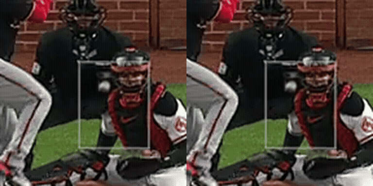
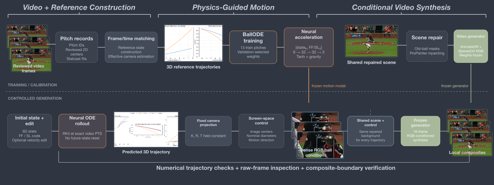

# Baseball Trajectory Modeling and Controlled Video Generation

<p align="center"><strong>Four-seam fastball (FF) &nbsp;&nbsp;&nbsp;&nbsp;&nbsp;&nbsp;&nbsp;&nbsp; Slider (SL)</strong></p>



[Download the FF video](assets/ff_fastball_slow_motion.mp4) · [Download the SL video](assets/sl_slider_slow_motion.mp4)

This project connects reviewed baseball video observations with Statcast-derived 3D reference states, a compact continuous-time trajectory model, fixed-camera projection, and conditional video synthesis. It supports reproducible FF/SL trajectory rollouts and controlled visual comparisons from editable initial states.

## Model architecture



The motion module is a 1,443-parameter BallODE. It receives a 6D state and a two-value FF/SL encoding, predicts non-gravity acceleration with an `8 → 32 → 32 → 3` Tanh network, and advances the state with RK4 at the exact video timestamps. A fixed camera maps the 3D rollout to screen-space controls used by the frozen video-generation stack.

## Data sources

- MLB broadcast clips provide the reviewed video frames and 2D ball centers. Broadcast imagery remains subject to the rights of its original owners.
- Baseball Savant / Statcast records provide pitch metadata and fitted 3D reference states in SI units.
- The current learning set contains 13 training pitches, 2 validation pitches, and 4 held-out pitches across four-seam fastballs and sliders.
- Large model weights and full raw broadcast archives are not redistributed.

## Getting started

Create a Python environment and install the local motion-model dependencies:

```bash
python -m venv .venv
source .venv/bin/activate
pip install -r requirements-local.txt
```

Run the saved-state CPU example:

```bash
python code/tools/predict_from_state.py --output ff03_rollout.json
```

The command uses the included small BallODE checkpoint and example input. It does not require raw video or a cloud account. Generation-specific dependencies are listed in `requirements-generation.txt`; exact upstream model identifiers are recorded in `configs/generative_models.json`.

### Error checks

| Held-out check | Result | Scope |
|---|---:|---|
| Position RMSE | 2.48 cm | Statcast-derived reference states |
| Velocity RMSE | 0.244 m/s | Same reference-state evaluation |
| Projected center error | median 1.28 px; P90 3.66 px | Includes camera and time-alignment error |
| Saved-state reproduction | maximum difference 0.0 | Included CPU rollout example |

These checks measure agreement with the constructed reference and reviewed centers; they are not independent multi-view 3D ground truth.

## References

- K. S. Yoon et al., [TrackNet: A Deep Learning Network for Tracking High-speed and Tiny Objects in Sports Applications](https://arxiv.org/abs/1907.03698).
- Y.-C. Huang et al., [TrackNetV3](https://github.com/qaz812345/TrackNetV3).
- R. T. Q. Chen et al., [Neural Ordinary Differential Equations](https://arxiv.org/abs/1806.07366).
- G. Zhou et al., [ProPainter](https://github.com/sczhou/ProPainter).
- [AnimateDiff](https://github.com/guoyww/AnimateDiff) and [SparseCtrl](https://github.com/guoyww/AnimateDiff/tree/main/animatediff/models/sparsectrl).
- MLB, [Baseball Savant](https://baseballsavant.mlb.com/).

## License

No blanket MIT, Apache, or other new open-source license is assigned to the repository. See [LICENSE_NOTICE.md](LICENSE_NOTICE.md) for component-level terms and provenance.

## Copyright and reuse

Copyright © 2026. All project-specific rights are reserved unless a file states otherwise. Repository access does not grant rights to MLB broadcast imagery, extracted sprites, Statcast records, upstream software, or downloaded model weights. ProPainter uses the S-Lab License 1.0 with non-commercial conditions, and every other upstream dependency remains governed by its own license. Review the original licenses before reuse or redistribution.
