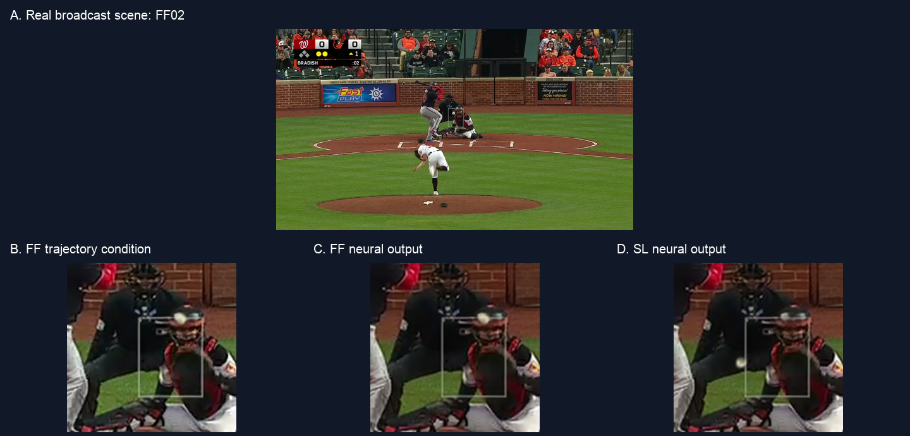

# Baseball Pitch Trajectory Modeling and Controlled Video Generation: A Pilot Implementation

**Phase I — completed implementation stages 1–5.** A personal project connecting reviewed 2D observations, Statcast-derived 3D reference states, learned continuous-state evolution, an explicit effective camera, editable initial conditions, and frozen video generation.



## Project package and report

- **[Download the complete Phase I project package](../../releases/download/v1.0-phase1/phase1_github.zip)** — code, README, consolidated documents, small ODE checkpoint, stage results, preview videos, exact raw generated frames, and reproduction tools. Unzip `baseball-trajectory-phase1/` and read its README.
- **[Read the informal English report (PDF)](Informal-report.pdf)** — supplied compiled report covering purpose, experiment details, implementation, limitations, real experiment figures and next-phase plans.
- **[Download the editable Overleaf report](../../releases/download/v1.0-phase1/phase1_overleaf_report.zip)** — upload to Overleaf and select `main.tex`.
- **[Release page](../../releases/tag/v1.0-phase1)** — package sizes and SHA256 checksums.
- **[License and asset provenance](LICENSE_NOTICE.md)** — separate project, upstream model/software, Statcast and broadcast rights.

The large ZIP is a Release asset rather than a source blob. Repository-root `PROJECT_MANIFEST.json` describes the contents of the unpacked project; those paths belong to the ZIP, not this landing repository. The local originals archive (raw broadcasts, historical workflow records and repeated frame sequences) is deliberately excluded from this upload.

## Completed work

1. Reused reviewed ball-center labels and corrected decoded-frame/time matching.
2. Constructed SI reference states from Statcast fits and estimated an effective camera/time mapping.
3. Trained a 1,443-parameter Neural ODE on 13 pitches, selected on 2, and evaluated on 4 held-out pitches.
4. Edited visible-flight initial velocities and FF/SL conditions while holding the learned model and camera fixed.
5. Repaired one shared scene with ProPainter, ran frozen AnimateDiff/SparseCtrl RGB generation for two 16-frame cases, preserved raw outputs, and inspected composites separately.

| Held-out check | Result | Interpretation |
|---|---:|---|
| Position RMSE | 2.48 cm | Against Statcast-derived reference, not independent 3D ground truth |
| Velocity RMSE | 0.244 m/s | Against the same reference |
| Projected center error | median 1.28 px; P90 3.66 px | Includes camera/time alignment error |
| Test samples | 70 future states; 69 reviewed centers | Seed excluded; missing observations not fabricated |
| Video pilot | FF/SL, 16 frames each | Dense RGB conditioning; fixed local scene |

SL has an identifiable ball in 16/16 inspected frames. FF has 12 clear frames and 4 uncertain late frames where the ball blends with helmet highlights. Generated-ball center P90 was not measured. Dense conditions may dominate appearance; actual spin, correct physical occlusion and arbitrary-camera generalization are not established.

## Reproduction

After downloading and unpacking the project ZIP, run from its root with compatible Python/Torch dependencies:

```sh
python tools/predict_from_state.py --output /tmp/ff03_rollout.json
python tools/verify_release.py
```

The saved-state CPU demo needs no raw video or cloud account. It reproduced the recorded trajectory with maximum state difference 0.0. Full alignment and media rebuilding require the separately retained original videos. See `docs/REPRODUCING.md` inside the project package.

## Copyright and reuse

This repository is private. No blanket MIT/Apache or other new open-source license has been assigned. Project availability does not grant rights to third-party broadcast imagery, extracted sprites, Statcast records, upstream code or downloaded model weights. The report's example images are broadcast-derived and retain the same third-party provenance.

ProPainter's recorded revision uses S-Lab License 1.0 with non-commercial conditions. Other upstream model/software licenses must be checked separately. Upstream large model weights are not redistributed. See [the detailed notice](LICENSE_NOTICE.md).
